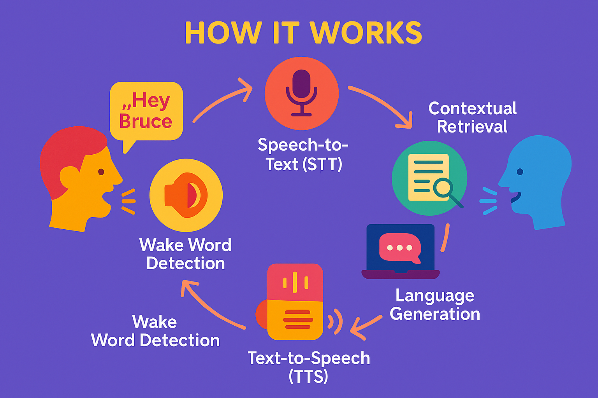

<div align="center">
    <h1> 🗣️ Speech-to-Speech Retrieval-Augmented Assistant (Bruce)</h1>
     
</div>

<br>
<br>

**Bruce** is an intelligent voice assistant pipeline that listens, understands, retrieves, reasons, and speaks — enabling seamless speech-to-speech interaction powered by Retrieval-Augmented Generation (RAG), whisper-based transcription, and wake-word activation via Porcupine.

---

## 🚀 Features

- 🎙️ **Wake Word Detection**: Trigger interaction with the phrase “Hey Bruce” using [Picovoice Porcupine](https://github.com/Picovoice/porcupine).
- 🧠 **RAG-based Reasoning**: Context-aware generation using an embedded vector database (`faiss_index.idx`) with chunked document retrieval.
- 🗣️ **Speech-to-Text + Text-to-Speech**: Uses Whisper for transcription and `pyttsx3` (or compatible engine) for natural voice synthesis.
- ⚡ **Real-time Interaction**: Listens for user input, queries a document corpus, and returns spoken responses in a human-like loop.

---

## 🧱 Project Structure

```S2S RAG/
├── S2S_v8.py / S2S_v9.py # Main assistant logic
├── .env # Environment variables (API keys, config)
├── requirements.txt # Python dependencies
├── doc_chunks.pkl # Pickled document chunks for retrieval
├── embeddings.npy # Pre-computed document embeddings
├── faiss_index.idx # FAISS index for fast similarity search
├── Hey-Bruce_en_windows_v3_0_0.ppn # Porcupine wake word model
├── info.txt # Text Corpus of which the RAG system wpuld make retrieval from 

```
---


## 🛠️ Setup Instructions

### 1. Set up Python environment

```bash
pip install -r requirements.txt
```

### 2. Add `.env` file

Create a `.env` file and add required environment variables:

```env
TOGETHER_API_KEY=your_api_key
PORCUPINE_API_KEY = your_api_key
GROQ_API_KEY = your_api_key
OPEN_API = your_api_key

```

### 3. Run the assistant

```bash
python S2S_v9.py
```

---

## 🧠 How It Works

### 🔊 Wake Word Detection
Listens for the wake word **“Hey Bruce”** using a `.ppn` model via Porcupine. 

### 🗣️ Speech-to-Text (STT)
Captures and transcribes user speech using OpenAI’s Whisper.

### 🔍 Contextual Retrieval
Searches document embeddings using FAISS to find the most relevant context from `doc_chunks.pkl`.

### 🧠 Language Generation
Sends query + context to a powerful language model (e.g., TogetherAI LLaMA) and retrieves the response.

### 🔁 Text-to-Speech (TTS)
Converts the generated response back to voice using `pyttsx3`.

---

## 📦 Dependencies

Key libraries (see `requirements.txt`):

- `openai-whisper`
- `pyttsx3`
- `faiss-cpu`
- `python-dotenv`
- `numpy`
- `pickle`
- `sounddevice`
- `pvporcupine` *(Porcupine wake word detection)*

---

## 🧪 Example Use Case

> **You**: "Hey Bruce, what is retrieval-augmented generation?"  
> **Assistant**: (searches documents)  
> **Response**: "Retrieval-Augmented Generation (RAG) is a method that improves language models by providing external context from a document database..."

---

## 📍 Roadmap

- [ ] Add multilingual support  
- [ ] Improve response latency via local quantized models  
- [ ] Add GUI interface  
- [ ] Deploy as web API for Raspberry Pi/Edge use  

---

## 🔐 Disclaimer

- Ensure you setup your personalized porcupine model (.ppn file) for the catch phrase 'Hey Bruce'
- Also make sure you have an 'info.txt' file which would serve as the text corpus knowledge base for the RAG system.   
---

## 🤝 Acknowledgements

- [Porcupine by Picovoice](https://github.com/Picovoice/porcupine)  
- [Whisper by OpenAI](https://github.com/openai/whisper)  
- [FAISS by Meta AI](https://github.com/facebookresearch/faiss)  
- [Together AI](https://www.together.ai/)  

---

## 📜 License

This project is licensed under the **MIT License**. See `LICENSE` for more information.
